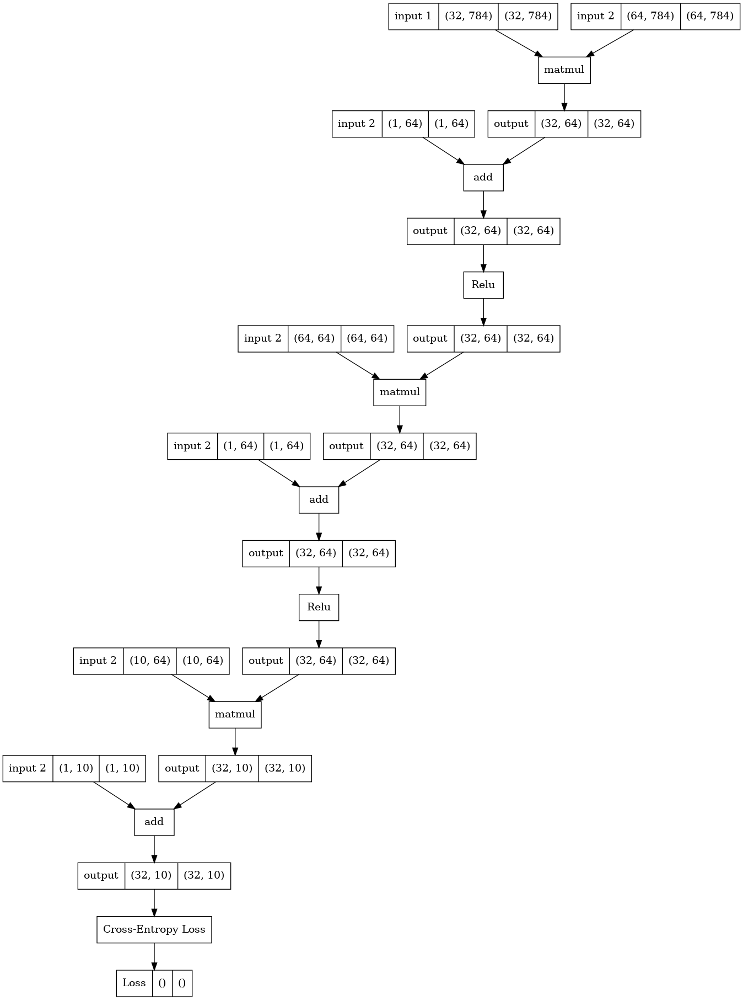

--------------------------------------------------------------------

This work is inspired by myself, [Andrej Karpathy micrograd](https://github.com/karpathy/micrograd) and [George Hotz tinygrad](https://github.com/geohot/tinygrad).

The purpose of this porject is to increase my knowledge in deep learning and to understand how everything works intuitively.  


--------------------------------------------------------------------

## MNIST Example
```python
from dlgrad.mlp import MLP
from datasets.fetch_mnist import MNIST 
from dlgrad.afu import ReLU
from nn.training import train, test, plot_metrics 

class Net:
    def __init__(self) -> None:
        self.fc1 = MLP(28*28, 64, bias=True)
        self.fc2 = MLP(64, 10, bias=True)

    def forward(self, x_train, flag=False):
        x = self.fc1(x_train, flag)
        x = ReLU(x, flag)
        x = self.fc2(x, flag)
        return x

def main():
    epochs = 5
    BS = 128
    lr = 1e-3
    flag = True
    
    net = Net()

    for epoch in range(epochs):
        mnist_dataset = MNIST()
        x_train, y_train = mnist_dataset.get_train_data()
        steps = x_train.shape[0]//BS

        train(net, mnist_dataset, x_train, y_train, steps, BS, lr)

    plot_metrics()

    x_test, y_test = mnist_dataset.get_test_data()
    test(net, x_test, y_test)
```

## Computational Graph
<p align="center">
  
</p>